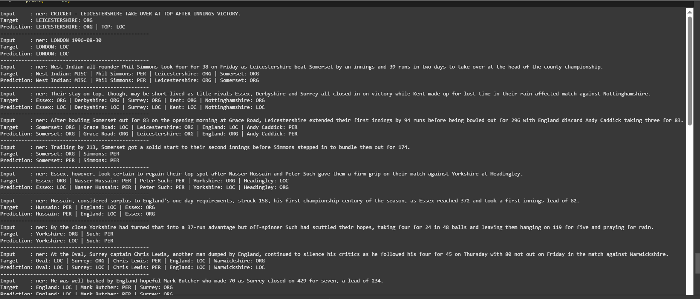

# 🧠 Fine-Tuning T5-small for Named Entity Recognition using LoRA (Pure PyTorch)

This repository demonstrates how to fine-tune the **T5-small** model on the [CoNLL-2003](https://huggingface.co/datasets/conll2003) dataset for **Named Entity Recognition (NER)** using **Low-Rank Adaptation (LoRA)** — all done with **pure PyTorch**, without using Hugging Face's `Trainer`, `PEFT`, or any built-in fine-tuning helpers.

---

## 📚 About the T5-small Model

T5 (Text-To-Text Transfer Transformer) is a powerful encoder-decoder model trained on a multi-task text-to-text framework.

**T5-small** configuration:
- Layers: 6 encoder / 6 decoder blocks
- Model dimension: 512
- Feed-forward dimension: 2048
- Attention heads: 8
- Parameters: ~60 million

---

## 🔧 What We Fine-Tuned

In this project, we fine-tuned **only the Q and V attention weights** of the following layers using **LoRA**:

- `encoder.block.1`
- `encoder.block.2`

All other weights are **frozen**, making the training light-weight and efficient.

---

## 🖼️ Architecture Visualization

*→ Add your model architecture image below:*


---

## 🚀 How to Run the Project

### 1. Clone the Repository

```bash
git clone https://github.com/yourusername/your-repo-name.git
cd your-repo-name
```

### 2. Install Dependencies

```bash
pip install -r requirements.txt
```

### 3. Run the Training Script

In your Python script or Jupyter notebook:

```python
# Example: Load dataset and tokenizer
from datasets import load_dataset
from transformers import T5Tokenizer
dataset = load_dataset("conll2003")
tokenizer = T5Tokenizer.from_pretrained("t5-small")

# Load and preprocess the data
# Define convert_to_t5_format, tokenize_batch etc.
# Load your T5 model and inject LoRA into encoder blocks 1 and 2

# Start training
train_model()
```

---

## 📉 Training Loss Curve

*→ Add your loss plot here:*


---

## ✅ Output Sample

*→ Add your output prediction screenshot here:*



---

## 📜 License

This project is licensed under the [MIT License](LICENSE).

---

## 🙋‍♂️ Author

**Senapathi Vishnu Vardhan**  
Machine Learning & NLP Engineer | BTech @ SRM University  
🔗 [GitHub](https://github.com/SVISHNUVARDHAN3610)

---
